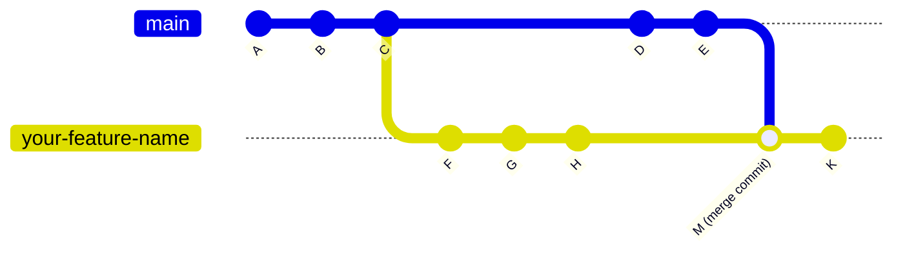

# Git How-to

## Contents
* [How to Rebase a Branch Interactively](#how-to-rebase-a-branch-interactively)

## How to Rebase a Branch Interactively
### Scenario 
Suppose this is what my branch history looks like



In my working branch `your-feature-name`, I wish to get rid of the commits that were all merged from `main`, but still keep the commits made after the merge.

### Solution
1) Make sure all changes in the local working branch are committed
2) Switch to the local branch you wish to rebase and make a safety branch as a backup
    ```
    git switch your-feature-name
    git branch your-feature-name-backup 
    ```
3) Start an interactive rebase from the commit before the merge, so that would be commit `H`.
   ```
   git rebase -i <commit-id-for-H>
   ```
4) An editor will show up