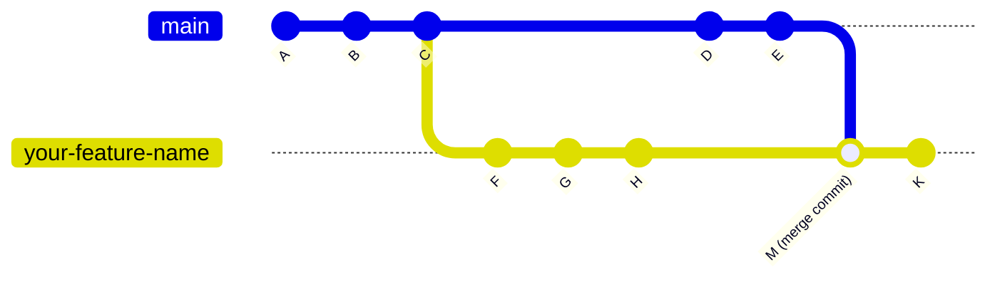

# Git How-to

## Contents
* [How to Rebase a Branch Interactively](#how-to-rebase-a-branch-interactively)

## How to Rebase a Branch Interactively
### Scenario 
Suppose this is what my branch history looks like



In my working branch `your-feature-name`, I wish to get rid of the commits that were all merged from `main`, but still keep the commits made after the merge.

### Solution
1) Make sure all changes in the local working branch are committed
2) Switch to the local branch you wish to rebase and make a safety branch as a backup
    ```
    git switch your-feature-name
    git branch your-feature-name-backup 
    ```
3) Start an interactive rebase from the commit before the merge, so that would be commit `H`.
   ```
   git rebase -i <commit-id-for-H>
   ```
4) An editor will show up that shows the following
    ```
    pick ecb098c commit D
    pick 03e40b0 commit E
    pick 2f23584 commit K
    ```
5) To drop all the commits that came in from the merge change `pick` to `drop` in this editor
    ```
    drop ecb098c commit D
    drop 03e40b0 commit E
    pick 2f23584 commit K
    ```
    1) If a conflict happens check the branch status and resolve the conflict
        ```
        git status
        # fix conflicting files
        ```
6)  Add the changes and continue with rebase
    ```
    git add .
    git rebase --continue
    ```
    1) If anything goes wrong abort the rebase
        ```
        git rebase --abort
        ```

    2) If the merged change in `your-feature-name` has already been pushed to the remote repository, you need to push the rebase changes in the following way
        ```
        git push --force-with-lease
        ``` 