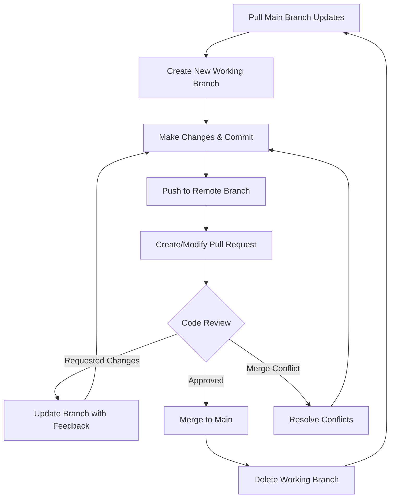
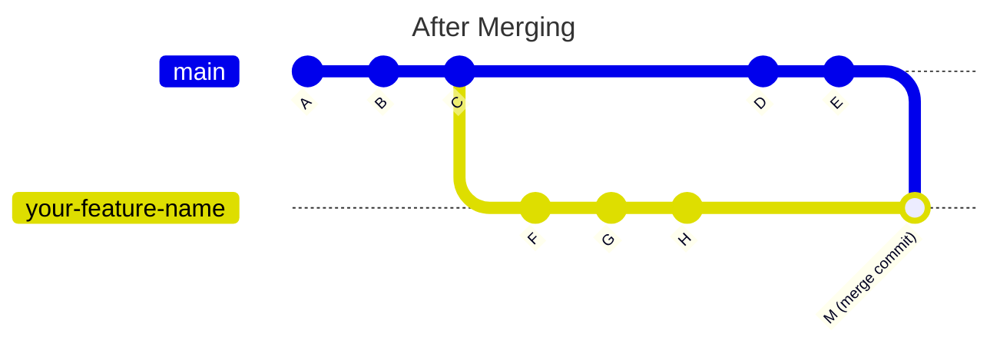
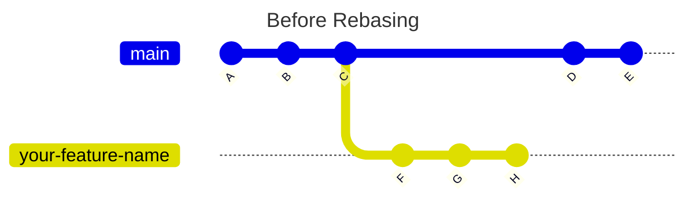
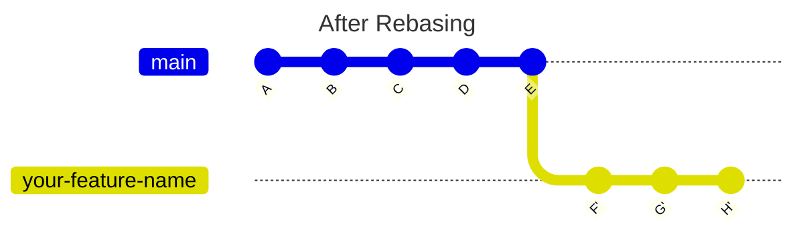

# Git Team Collaboration Workflow

This guide outlines the steps for collaborating with other developers on your team using git.


## Contents

[Initial Setup](#initial-setup)

[Workflow](#workflow)

[Merge or Rebase](#merge-or-rebase)

[Best Practices](#best-practices)

## Initial Setup
Clone the remote repository from the remote git repository and `cd` into that repo.
```bash
git clone <repository-url>
cd <repository-name>
```


## Workflow



### 1. Pull Main Branch Updates
This is done to pull any new updates your team might have made to the main branch of the repo. Good practice to do this before starting to work on a new branch to see new changes
```bash
git checkout main 
git pull origin main 
```
### 2. Create New Working Branch
Create a separate branch from the main branch where you will make changes independent of the main branch

Branch naming conventions:

- `feature/description` - New features
- `bugfix/description` - Bug fixes
- `hotfix/description` - Urgent fixes
- `refactor/description` - Code refactoring

```bash
git checkout -b feature/your-feature-name
```

### 3. Make Changes & Commit
Stage all changes
```bash
git add .
```
Commit with a descriptive message 
```bash
git commit -m "Descriptive commit message"
```

### 4. Push to Remote
Push the new commits in the working branch to the remote repository
```bash
git push origin feature/your-feature-name
```

### 5. Create/Modify Pull Request
On the remote repository, create a pull request if one doesn't already exist for the branch you're working on.

For GitHub: 

1. Go to GitHub repository
2. Click "New Pull Request"
3. Select your feature branch to compare with main
4. Add title and description
5. Click "Create Pull Request"

You can also modify the branch on an existing pull request if you need to make additional changes to the branch after the pull request has already been created. Additional commits to the branch show up automatically on the existing pull request once you push the change from local to remote. 

Example of a pull request description:
```markdown
## What does this PR do?

(describe the changes here)

## Related tickets

(link any related issues or past PRs here)

## Screenshots

(if applicable, add screenshots here)

## How to test

(steps for testing the changes)

## Additional notes

(any other information, optional)
``` 
### 6. Code Review
- Team members review your changes
- Address feedback if requested
- Update your branch with changes if needed
- Resolve any merge conflicts with the main branch

**Keep working branch updated as new commits in the main branch come in**\
Make sure to keep your working branch updated while waiting for the review process. The main branch may have new commits you need to address in your working branch while your branch is under review.
Two options for addressing new commits in the main branch for the working branch: [Merge or Rebase](#merge-or-rebase)


### 7. Merge to Main and Delete Working Branch

- Once approved, click "Merge Pull Request"
- Choose merge strategy (Squash, Rebase, or Merge)
- Delete the working branch after merging


## Merge or Rebase

### Merging two branches
Here we are merging the main branch into a working branch named `feature/your-feature-name`
```bash
# switch to the main branch in the local repo
git checkout main
# pull commits from remote to local repo for main branch
git pull origin main
# switch to the working branch in the local repo
git checkout feature/your-feature-name
# merge the main branch to the working branch
git merge main
```
When to use `merge`:

- Before creating a pull request
- When pull request sits open for a while and main has moved forward
- Daily or every few days while working on long-running features
- When you see "This branch is out-of-date with the base branch"
- You are working on a public/shared branch
- You want to preserve the true commit timeline




### Rebasing 
Here we are rebasing the working branch named `feature/your-feature-name` into the main branch
```bash
# switch to the working branch in the local repo
git checkout feature/your-feature-name
# rebase working branch to the main branch
git rebase main
```
Since the working branch history has changed after rebasing, you will need to force push to the remote working branch.
```bash
# push working branch commits from local to remote, this will also check that no one else pushed changes to your working branch before overwriting 
git push --force-with-lease
```

What does `rebase` do:

1. Takes commits from the working branch
2. Temporarily removes them
3. Fast-forwards the working branch to match the latest main branch
4. Replays your working branch commits one-by-one on top of the latest main branch

When to use `rebase`: 

- You're working on a branch that only you work on
- You want a cleaner and easier to read commit history




## Best Practices

- Always pull the latest changes before starting new work
- Keep commits atomic and well-documented
- Review your own changes before requesting review
- Resolve conflicts locally before pushing
- Delete remote branches after merging to keep repository clean