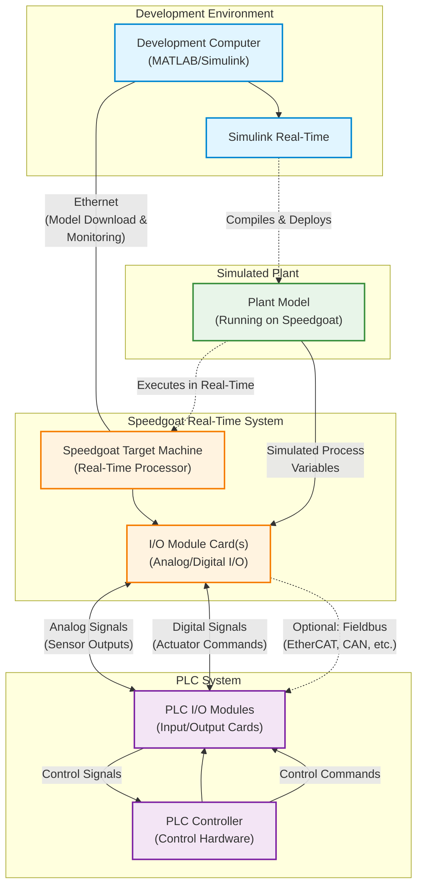

# Demo: Hardware-in-the-Loop (HiL) with Speedgoat
This demo shows how to test a PLC control system in a HiL setup with a Speedgoat target machine. Video for this demo can be found [here](https://www.youtube.com/watch?v=Rb3Aefnu0NY)

