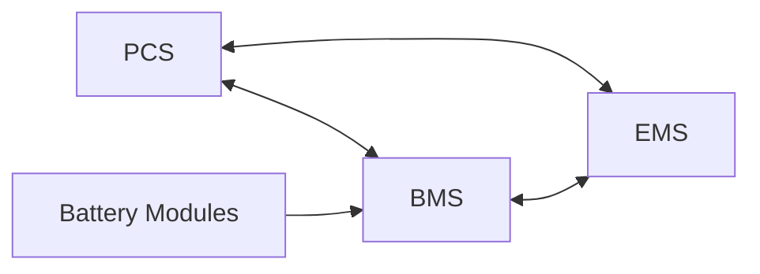

# Battery Energy Storage System (BESS)

## Components
- Battery Modules: electro-chemical cells where energy is stored
    - Lithium-Ion - most common for grid scale applications
    - Lead Acid
    - Sodium Based
    - Redox Flow
- Battery Management System (**BMS**)
    - monitors **voltage**, **temperature**, **state of charge**
    - prevents **overcharging**, **deep discharging**, **overheating**
- Power Conversion System (**PCS**)
    - batteries store DC power, grid operate on AC, PCS converts power both ways
    - handles voltage regulation and frequency response
    - contain components like inverters and chargers
- Energy Management System (**EMS**)
    - brain behind energy optimization
    - decide when to charge, discharge, or remain idle 
    - supports functions like:
        - energy arbitrage
        - frequency response
        - renewable smoothing
- Thermal Management System (TMS)
    - prevents overheating or freezing of batteries
    - integrated with BMS

- Protection and Safety System 
    - Circuit Breakers
    - Fuses
    - Surge Protectors
    - Isolation Devices

- Step Up Transformers
    - Used to step up voltage levels
    - electrical isolation

