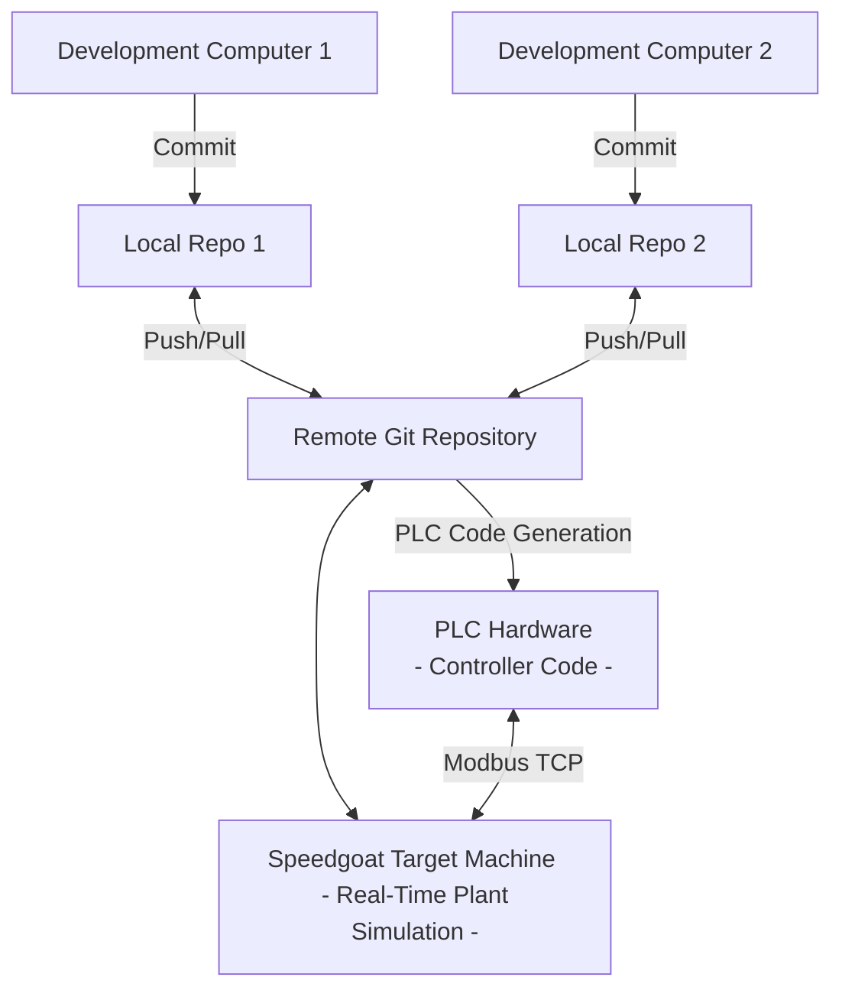

```mermaid
graph TD
    DPC1[Development Computer 1]
    LR1[Local Repo 1]
    DPC2[Development Computer 2]
    LR2[Local Repo 2]
    RR[Remote Git Repository]

    PLC[PLC Hardware </br> - Controller Code -]
    STM[Speedgoat Target Machine </br> - Real-Time Plant Simulation -]

    DPC1 --> |Commit| LR1
    DPC2 --> |Commit| LR2
    LR1 <--> |Push/Pull| RR
    LR2 <--> |Push/Pull| RR

    RR --> |PLC Code Generation| PLC
    RR <--> STM
    PLC <--> |Modbus TCP| STM


```

## Feeder

