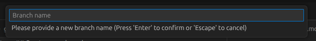
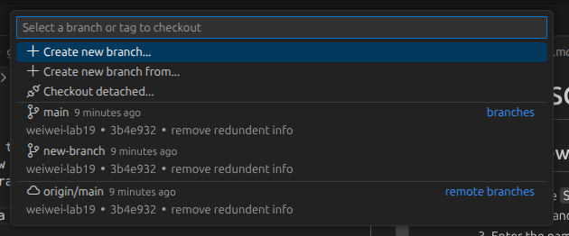
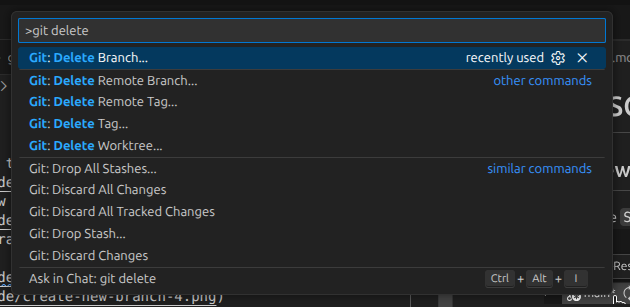
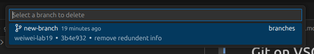

# Git on VSCode

## Create a new branch
1. Click on the `Status Bar` at the bottom left\

2. The Command Palette will show up, click on `Create new branch...`\

3. Enter the name of your new branch and press `Enter`. Here it is just called `new-branch`\
\

4. Now you should have created a new branch called `new-branch`\

## Delete an Existing Branch
1. Make sure the current branch you're working in is not the branch you want to delete.\
2. Open the Command Palette by pressing `Ctrl+Shift+P`. Type in `git delete` and a suggestion for deleting a branch will show up.\

3. Choose the branch you wish to delete.\

