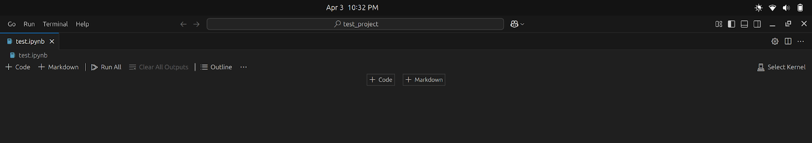
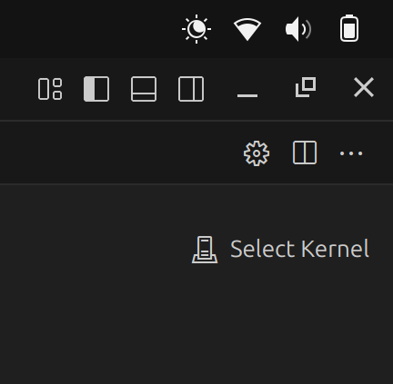
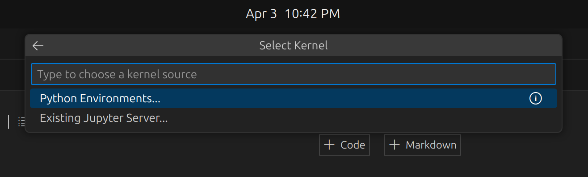
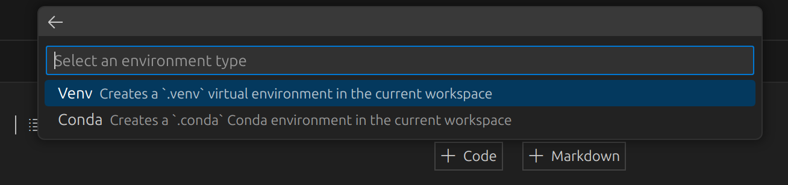
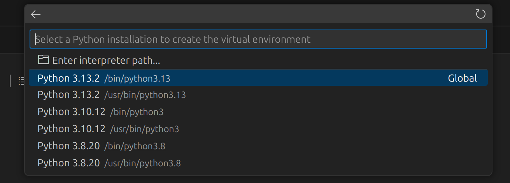
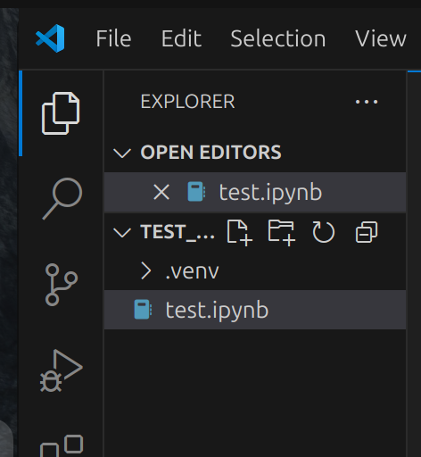
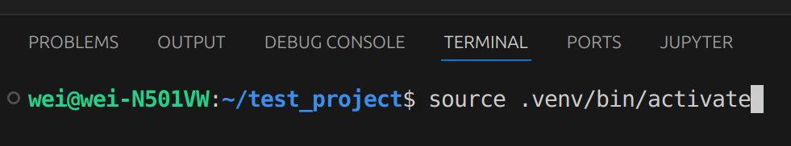

# Jupyter Notebook on VSCode
This shows how to work with Jupyter Notebook in the VSCode environment. We will see how to run different kernels for Jupyter notebook in VSCode to run python code, compile C/C++ code, and run Octave code via different kernels in Jupyter Notebook.

Install Jupyter extention on VSCode Marketplace
- Jupyter by Microsoft\
This will also install 4 additional extension packages automatically. 

VSCode will interpret files with extension `.ipynb` as a jupyter notebook file.  

## Contents
[Python Kernel](#python-kernel)

[C/C++ Kernel](#cc-kernel)

[Octave Kernel](#octave-kernel)

[Jupyter Notebook to HTML or PDF](#jupyter-notebook-to-html-or-pdf)

[Useful VSCode Marketplace Extensions for Jupyter Notebook](#useful-vscode-marketplace-extensions-for-jupyter-notebook)

## Python Kernel
Setting up python kernel on jupyter notebook in vscode.

Create a python project directory, change to that directory and open vscode with
```bash
~$ mkdir my_project
~$ cd my_project
~/my_project$ code .
```

Create a new jupyter notebook file with extension `.ipynb` in the current working directory. This will create a jupyter notebook tab that looks like the following:


To create a python virtual environment in the jupyter note tab and use it as the kernel, do the following steps:
1. Click `Select Kernel` on the far right of the tab, this will bring up the Command Palette

2. Select `Python Environments...`

3. Select `Create Python Environments`

4. Select `Venv`

5. Select the python version you want to use

6. This will create the virtual environment directory `.venv` in the working directory.

7. Activate the virtual environment in the terminal using 
```bash
$ source .venv/bin/activate
```

8. Install python packages with `pip` and it will be included in your jupyter notebook project

## C/C++ Kernel
This section shows how to set up C/C++ kernels in Jupyter Notebook on VS-Code 

Note: Seems like `xeus-cling` is not available for Windows

The following was performed in a linux environment:
1. Make sure minconda is installed in the linux environment
2. Create a new conda environment called `c_cpp_env`
    ```bash
    name@name:~$ conda create -n c_cpp_env python=3.9
    ```
3. Activate the conda environment
    ```bash
    name@name:~$ conda activate c_cpp_env
    ```
4. Install notebook in the conda environment
    ```bash
    (c_cpp_env)name@name:~$ conda install notebook
    ```
5. Install the package `xeus-cling` in the conda environment, this will install C++ kernel for jupyter notebook.
    ```bash
    (c_cpp_env)name@name:~$ conda install -c conda-forge xeus-cling
    ```
6. Install the C kernel for jupyter notebook and make it available for jupyter with:
    ```bash
    (c_cpp_env)name@name:~$ pip install jupyter-c-kernel
    (c_cpp_env)name@name:~$ install_c_kernel --user
    ```
7. Change directory into the working C/C++ directory
    ```bash
    (c_cpp_env)name@name:~$ cd my_project
    ```
8. Open vscode
    ```bash
    (c_cpp_env)name@name:~/my_project$ code .&
    ```
9. In vscode terminal, get the jupyter notebook server address
    ```bash
    (c_cpp_env)name@name:~/my_project$ jupyter notebook --no-browser
    ```
    Server address for jupyter notebook looks something like:\
    http://127.0.0.1:8888/?token=8daf8ff423flbakfcek423f

10. Copy the server address and open a notebook file (`.ipynb`) in vscode
11. On the top right, click `Select Kernel`
12. Click on `Select Another Kernel` &rarr; `Existing Jupyter Server...` &rarr; Paste the copied jupyter server address &rarr; `Enter`
13. Select the C++ or C kernel you want to use
14. Now you should be able to run C/C++ code in jupyter notebook on vscode

## Octave Kernel
This section shows how to set up Octave kernel in jupyter notebook on vscode 

The following was performed in a linux environment:
1. Make sure minconda is installed in the linux environment
2. Create a new conda environment called `octave_env`
    ```bash
    name@name:~$ conda create -n octave_env python=3.9
    ```
3. Activate the conda environment
    ```bash
    name@name:~$ conda activate octave_env
    ```
4. Install notebook in the conda environment
    ```bash
    (octave_env)name@name:~$ conda install notebook
    ```
5. Install the package `xeus-octave` in the conda environment, this will install Octave kernel for jupyter notebook.
    ```bash
    (octave_env)name@name:~$ conda install -c conda-forge xeus-octave
    ```
6. Change directory into the working Octave directory
    ```bash
    (octave_env)name@name:~$ cd my_project
    ```
7. Open vscode
    ```bash
    (octave_env)name@name:~/my_project$ code .&
    ```
8. In vscode terminal, get the jupyter notebook server address
    ```bash
    (octave_env)name@name:~/my_project$ jupyter notebook --no-browser
    ```
    Server address for jupyter notebook looks something like:\
    http://127.0.0.1:8888/?token=8daf8ff423flbakfcek423f

9. Copy the server address and open a notebook file (`.ipynb`) in vscode
10. On the top right, click `Select Kernel`
11. Click on `Select Another Kernel` &rarr; `Existing Jupyter Server...` &rarr; Paste the copied jupyter server address &rarr; `Enter`
12. Select the Octave kernel you want to use
13. Now you should be able to run Octave code in jupyter notebook on vscode

## Jupyter Notebook to HTML or PDF
This section will show how to convert a jupyter notebook file to html file for reading on a web browser. This will use `pretty-jupyter` to create html template with a table of contents.

### On Linux System
1) Make sure jupyter notebook is installed in the python virtual environment
    ```bash
    $ pip install jupyterlab notebook
    ```
2) For generating html files
    1) Install `pretty-jupyter`, this creates a htlm template with a table of contents
        ```bash
        $ pip install pretty-jupyter
        ```
    2) Convert the jupyter notebook file to html
        ```bash
        $ jupyter nbconvert --output-dir './html_dirname' --to html --template pj jupyter_file1.ipynb jupyter_file2.ipynb
        ```
        or

        for converting all `.ipynb` files
        ```bash
        $ jupyter nbconvert --output-dir './html_dirname' --to html --template pj *.ipynb
        ```
3) For generating pdf files
    1) Install `pandoc`
        ```bash
        $ sudo apt-get install pandoc
        ```
    2) Install `texlive` if not already installed, `nbconvert` converts the jupyter notebook to a `.tex` file and then uses texlive to convert the `.tex` file to pdf
        ```bash
        $ sudo apt-get install texlive-full
        ```
    3) Convert the jupyter notebook file to pdf
        ```bash
        $ jupyter nbconvert --output-dir './pdf_dirname' --to pdf jupyter_file1.ipynb jupyter_file2.ipynb
        ```
        or

        for converting all `.ipynb` files
        ```bash
        $ jupyter nbconvert --output-dir './pdf_dirname' --to pdf *.ipynb
        ```
4) Make sure you've ran the `.ipynb` files before converting to html or pdf, otherwise the file will not have the output of the cells in the notebook

## Useful VSCode Marketplace Extensions for Jupyter Notebook
- Jupyter by Microsoft
- Data Wrangler by Microsoft