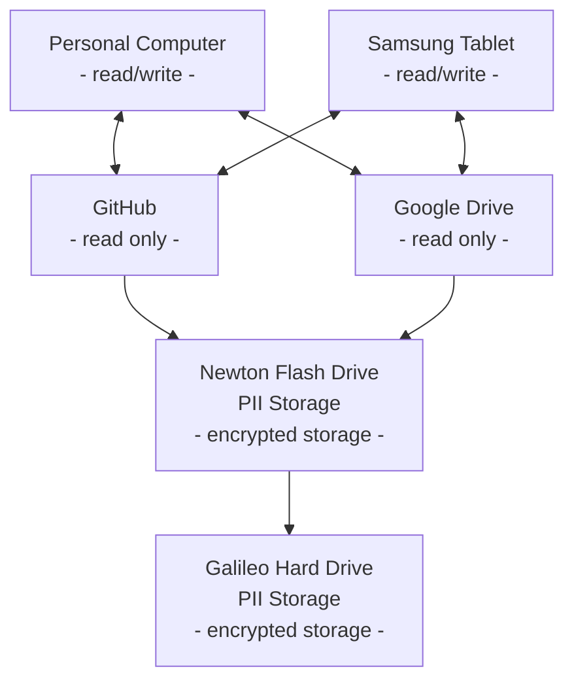

# File Backup Procedure
Once a month, back up all files in google drive and github onto Newton and Galileo Drives

Date of last backup: **Jan. 6, 2026**

Since the last backup:\
GitHub - 12 repositories\
Google Drive - 366 files


## Storage Architecture

PII - Personally Identifiable Information (Only read and write PII docs on Newton Flash Drive)

## Note: Manual Source Control of Google Drive Files
The google drive used for the sole purpose of file storage is under the email: 
`wei.ultra.th78@gmail.com`

- Only download files from google drive that need to be changed onto Personal Computer or Samsung Tablet 
- Once changes are made, update the Google Drive to reflect those changes by uploading the changed file
- File system in Linux and Samsung Tablet should be the same as google drive for keeping track of google drive file changes
- On Samsung Tablet, files are only modified on the Samsung notes app

## 1. Backup GitHub Repositories
1) Ensure all local repositories on the Personal Computer and Samsung Tablet are synced with the remote repository on GitHub
2) Download all remote repositories from GitHub as `.zip` files.
3) Extract all downloaded `.zip` files to a folder in the Newton Flash Drive named: `GitHub Repository Backup - MMDDYYYY` where `MMDDYYYY` is the date the backup was performed.
    - `MM` - two digit month
    - `DD` - two digit day
    - `YYYY` - four digit year

## 2. Backup Google Drive
### 1. On the Samsung Tablet:
1. Open the Samsung notes app
2. Go to `All notes` and sort by `Date modified`
3. Update changes to all files that have been modified since the last backup date. Do the following for each modified file:  
    1. Download the `.pdf` and `.sdocx` (samsung notes file) version of the file into the `Import` folder in the google drive. Note: Downloading from the samsung notes app will change the name of the original file.
    2. Rename the file to its appropriate name on the google drive.
    3. Delete the existing version of the file on the google drive.
    4. Move the updated version of the file from the `Import` folder to its proper folder. 

### 2. On the Personal Computer (Running Linux)
1) Open the terminal 
2) `cd` into the google drive directory 
    ```bash
    cd Google\ Drive/
    ```
3) List the last modified dates of 100 most recently modified files in the directory
    ```bash
    find . -type f -printf '%TY-%Tm-%Td-%TH:%TM:%TS %p\n' | sort -k1r | head -100
    ```
4) Update all files that have been modified since the last backup date:\
        If the file that needs to be updated already exists in the google drive:\
            - Delete the existing old version from the google drive\
            - Upload the new version in the same location on the drive\
        If the file that needs to be updated is new and not already in the google drive:\
            - Upload it to the appropriate location on the google drive

### 3. Backup Google Drive onto Newton Flash Drive
1) Download the entire google drive, this will download multiple `.zip` files containing the folders within the google drive. Note: the contents in the folders might be split within each `.zip` file.
2) Extract all `.zip` fles and combine the contents according to the structure of the google drive.  
    ```bash
    cd Downloads
    mkdir combined
    unzip '*.zip' -d combined
    ```
    The commands above: 
    - changes directory to the `Downloads` directory where the `.zip` files are located
    - makes a new directory called `combined`
    - extracts all `.zip` files in the current directory and combines them into the `combined` directory.
3) Check the total number of files in the google drive:
    1. Go to the google drive
    2. Click on `Storage` and keep scrolling down until all the files in the storage are loaded.
    3. Press `Ctrl+A` to select all files. The number of files selected should tell you the total number of files in the google drive
4) Check the total number of files downloaded
    1. Go to the `Downloads` directory
        ```bash
        cd Downloads
        ```
    2. Run these commands in the `Downloads` directory to see how many total files are in the `combined` directory:
        ```bash
        ls -l . | egrep -c '^-'
        find . ! -name . -prune -type d -exec sh -c '
        for dir do
            dir="${dir#./}"
            printf "%s:\t" "$dir"
            find ".//$dir" -type f | grep -c //
        done' sh {} +
        ```
        Something like this should show:
        ```bash
        5
        combined:	366
        ```
        This tells you there are 5 files in the `Downloads` directory and one subdirectory called `combined` with 366 files in it. 
5) Verify that the number of files in `combined` is the same as the number of files in the google drive. 
6) Rename the `combined` directory as `Google Drive Backup - MMDDYYYY` where `MMDDYYYY` is the date the backup was performed.

## Store Backups into External Drives
1) Upload `GitHub Repository Backup - MMDDYYYY` and `Google Drive Backup - MMDDYYYY` folders into the Newton Flash Drive.
2) Upload all the contents in the Newton Flash Drive into a folder in the Galileo Hard Drive named `Newton-MMDDYYYY`


